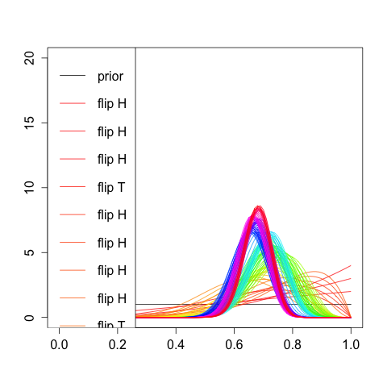

# Beta Distribution


## Intuition


A Beta distribution is used to model things that have a limited range, like 0 to 1.

Examples are the probability of success in an experiment having only two outcomes, like success and failure. If you do a limited number of experiments, and some are successful, you can represent what that tells you by a beta distribution.

Another example is order statistics. For example, if you generate several (say 4) uniform 0,1 random numbers, and sort them, what is the distribution of the 3rd one?

Beta distribution can be understood as representing a distribution of probabilities. 
For example if we are given the unknown coin, which may be fair or unfair so how to we estimate it's probability? well we know that a coin prior i.e p = 0.5 and then we toss the coin multiple times in a series of experiment and after every experiment we update our estimated probability using the bayes rule i.e posterior is proportional to likelihood * prior.
After enough samples and experiments we will get the real p of the given coin.


## Mathematical Representation


$$P(x;\alpha, \beta) = \frac{1}{B(\alpha, \beta)}x^{\alpha}(1-x)^{\beta-1}, x \in (0,1)$$


## Application
Beta and it's cousin Dirichlet Distribution has many applications. In ML context Dirichlet is used in the topic modeling LDA.

## Example
Here we can see the output plot using R to use beta distribution to estimate the probability of the coin. Note that in the end the maximum probability is at 0.65


Here is the sample r code to illustrate the beta distribution intuition

```R
coinWeights <- c(.65,.35)

prior <- c(1,1)

scnt=100
numFlips <- scnt

flips <- sample(1:2, numFlips, prob=coinWeights, replace=TRUE)
print(flips)

betaDist <- function(alphaBeta) {
  function(x) {
    dbeta(x, alphaBeta[1], alphaBeta[2])
  }
}

colors <- rainbow(numFlips)

plot(betaDist(prior), xlim=c(0,1), ylim=c(0,scnt/5), xlab="", ylab="")
for (n in 1:numFlips) {
  prior[flips[n]] <- prior[flips[n]] + 1
  func <- betaDist(prior)
  curve(func, from=0, to=1, add=TRUE, col=colors[n])
  Sys.sleep(0.5)
}


legend("topleft", legend=c("prior",paste("flip",c("H","T")[flips])), col=c("#000000",colors), lwd=1)
```


## References and More Readings


[Beta distribution more informations](https://en.wikipedia.org/wiki/Beta_distribution)